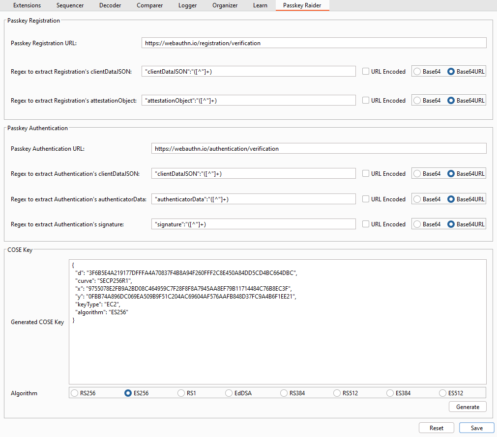
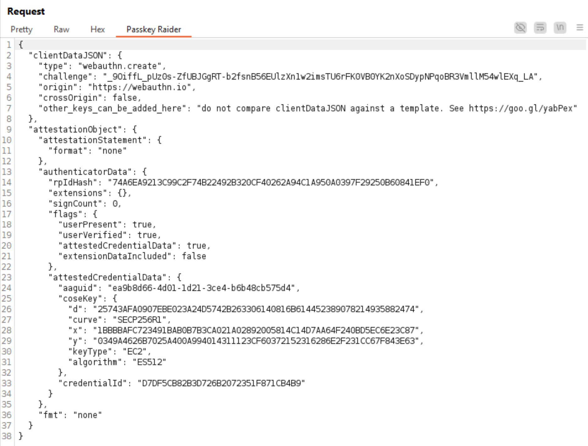
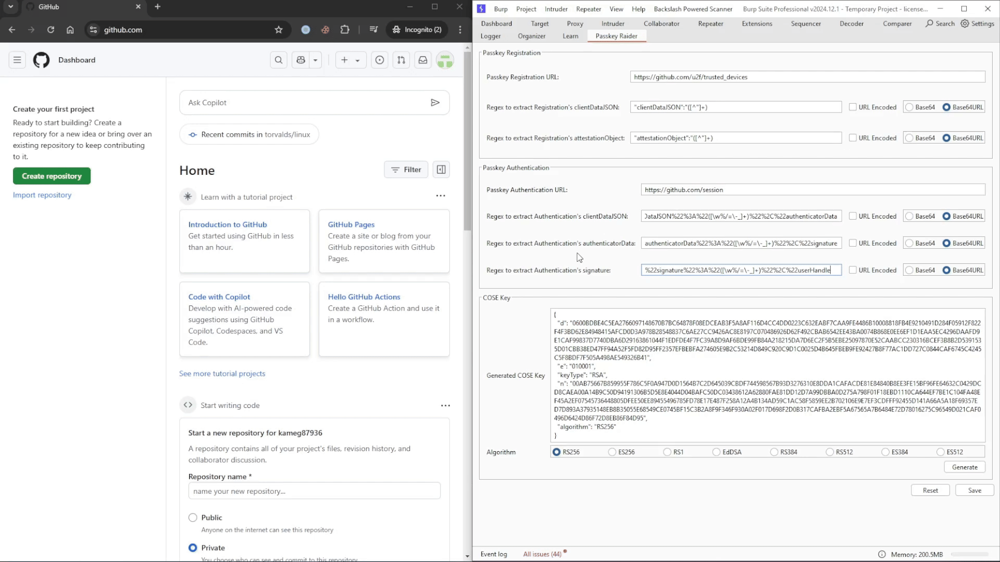

# Passkey Raider - Burp Suite Extension

## Description

Passkey Raider is a Burp Suite extension designed for testing Passkey systems. It offers three core functionalities:

1. Decode and encode Passkey data in HTTP requests.
2. Automatically replace the public key in Passkey registration flows with a generated public key.
3. Automatically sign data in Passkey authentication flows using a generated private key.

## Features

* **Regex Support:** Extract clientDataJSON, attestationObject, authenticatorData, and signature values from HTTP requests.
* **Data Decoding/Encoding:**
   * clientDataJSON
   * AttestationObject
   * authenticatorData
   * Attestation Statement (None, AndroidKey, AndroidSafetyNet, AppleAnonymous, FIDOU2F, Packed, TPM)
* **Algorithms Support:** Generate key pairs using algorithms such as RS256, ES256, RS1, EdDSA, RS384, RS512, ES384, and ES512.
* **Automation:**
   * Replace the public key during Passkey registration flows. 
   * Sign data in Passkey authentication flows automatically.
* **Project Integration:** Save and load settings directly into Burp Suite project file.
* **Request Highlighting:** Identify and highlight Passkey registration and authentication requests in the Proxy tool.

## Installation

### From the BApp Store

The recommended and easiest method is via Burp Suite's BApp Store. Refer to the [Burp Suite documentation](https://portswigger.net/burp/documentation/desktop/extensions/installing-extensions) for detailed steps.

### Manual Installation

1. Download the latest release:
[Passkey-Raider-1.0.0.jar](https://github.com/siamthanathack/Passkey-Raider/releases/download/v1.0.0/Passkey-Raider-1.0.0.jar).
2. Open Burp Suite, navigate to `Extensions` > `Add`, and load the JAR file.

## Building from Source
Passkey Raider can be built from source using [IntelliJ IDEA](https://www.jetbrains.com/idea/).

### Prerequisites
* Install the [Swing UI Designer plugin](https://www.jetbrains.com/help/idea/design-gui-using-swing.html).

### Steps
1. Configure IntelliJ IDEA:

   In the `File` menu, go to `Settings`.
   * `Build, Execution, Deployment` -> `Build Tools` -> `Gradle`
      * Build and run using: IntelliJ IDEA
      * Run tests using: IntelliJ IDEA
   * `Editor` -> `GUI Designer`
      * Generate GUI into: Java source code
2. Clone the repository:

   In the `File` menu, go to `New` -> `Project from Version Control...`.
   * URL: https://github.com/siamthanathack/Passkey-Raider
3. Build the project:

   * Navigate to `Build` > `Build Project`.
   * Run the `shadowJar` task in the Gradle tool window on right hand side of the IntelliJ IDEA.
4. The JAR file (`Passkey-Raider-1.0.0.jar`) will be generated in the `build/libs` directory.

## Usage

The extension provides two main components: Settings Page and Passkey Message Editor.

### Setting Page

Configure Passkey settings such as URLs, regex patterns for extracting data, and generating key pairs before Passkey testing.



### Passkey Message Editor

View and edit decoded Passkey data directly within HTTP requests.

**Passkey Registration Request:**



**Passkey Authentication Request:**


## Demo

### Testing Passkey on Github
1. Configuration

    1.1 Identify Passkey registration URL and Regex patterns for clientDataJSON/attestationObject.

    Please note that grouping in Regex (subpattern enclosed within the parentheses ()) is required since the extension will use the matched data in group.

    In this case, default Regex in the extension can be used for Github.

    

    1.2 Identify Passkey authentication URL and Regex patterns for clientDataJSON/authenticatorData/signature.

    

    1.3 Set URL, Regex, generate COSE Key
    ```
    Passkey Registration URL: https://github.com/u2f/trusted_devices
    Regex to extract Registration's clientDataJSON: "clientDataJSON":"([^"]+)
    Regex to extract Registration's attestationObject: "attestationObject":"([^"]+)
    Passkey Authentication URL: https://github.com/session
    Regex to extract Authentication's clientDataJSON: %22clientDataJSON%22%3A%22([\w%/=\-_]+)%22%2C%22authenticatorData
    Regex to extract Authentication's authenticatorData: %22authenticatorData%22%3A%22([\w%/=\-_]+)%22%2C%22signature
    Regex to extract Authentication's signature: %22signature%22%3A%22([\w%/=\-_]+)%22%2C%22userHandle
    ```

    

2. Add New Passkey

   After setting the configuration, the extension will automatically change COSE key (public key) in Passkey registration HTTP request with generated COSE Key.
  
   

   This allows us to edit clientDataJSON and authenticatorData in Passkey authentication HTTP request since the extension will automatically sign data with generated COSE Key (private key) and change signature value.

3. Sign In with Passkey and test to edit Passkey data

   The extension will automatically sign edited data with generated COSE Key (private key) and change signature value.

   


## Useful Links
* [Passkeys](https://fidoalliance.org/passkeys)
* [What are Passkeys and How Do They Work?](https://www.descope.com/learn/post/passkeys)
* [Authenticator Data](https://www.w3.org/TR/webauthn-1/#sec-authenticator-data)
* [Authenticator Data layout](https://www.w3.org/TR/webauthn-1/#fig-authData)
* [Generating an assertion signature](https://www.w3.org/TR/webauthn-1/#fig-signature)
* [CBOR Object Signing and Encryption (COSE)](https://www.iana.org/assignments/cose/cose.xhtml)
* [Passkeys Directory ](https://passkeys.directory/)
* [Demo: passkeys.io](https://www.passkeys.io/)
* [Demo: webauthn.io](https://webauthn.io/)
* [Demo: webauthn.me](https://webauthn.me/)
* [Demo: demo.yubico.com](https://demo.yubico.com/webauthn-technical/)
* [Passkeys Debugger: passkeys-debugger.io](https://www.passkeys-debugger.io/)
* [Passkeys Debugger: webauthn.me](https://webauthn.me/debugger)
* [Passkeys Authenticator AAGUID Explorer](https://passkeydeveloper.github.io/passkey-authenticator-aaguids/explor)

## License

See the [LICENSE](LICENSE) file (MIT License) for license rights and limitations.

## Author

* Peeranat Thantaletong